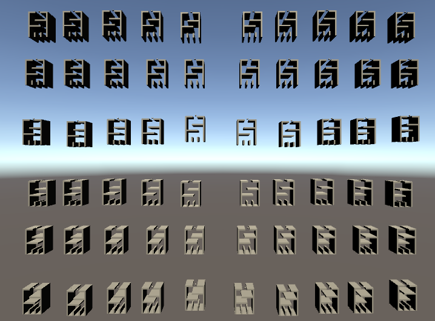

# MLAgent

This is a simple level where a ball is guided to the correct spot by a Unity Machine Learning Agent. First a training level was created to speed this up. The output of this is a model that can be used for the main level.

For this to work the following functions must be implemented:
- CollectObservations: Used to define which variables the agent observes
- OnEpisodeBegin: Defines the default values so the level can be reset
- OnActionReceived: Transforms the output from the agent to an input the level can use

A reward mechanism is also necessary. In this case there are colliders placed at the bottom of the level. It is considered a win if the ball lands in the middle. Everything else is considered a failure.

The level used for training

The end result

